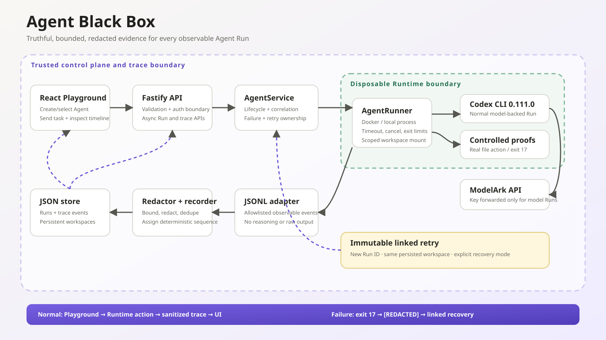
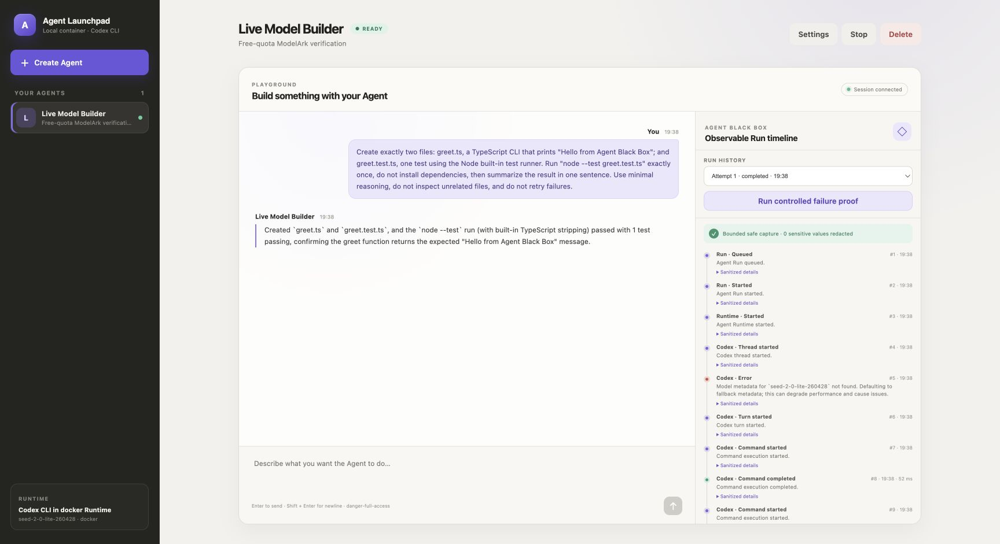
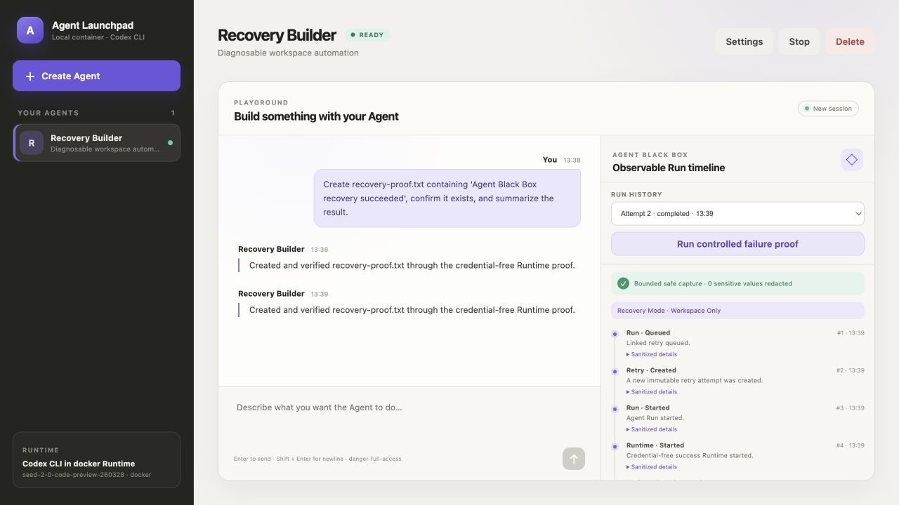
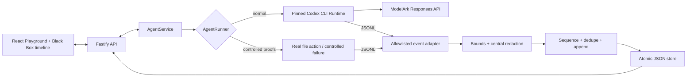

# Agent Black Box

**Every Agent Run tells the truth.** Agent Black Box is lightweight middleware
that turns the observable path of a Run into a correlated, redacted timeline.
Operators can see control-plane lifecycle, Runtime boundaries, command and file
evidence, model usage, and the most specific failure boundary the platform can
honestly support.

**Public demo:** [Watch the 47-second Agent Black Box walkthrough](https://youtu.be/TnMpTMwM82U)

The project extends the TikTok TechJam 2026 Track 1 starter without replacing
its Agent CRUD, Playground, persistent workspaces, resumable sessions, JSON
store, disposable Runtime containers, or ModelArk integration.

> [!WARNING]
> This remains a single-user hackathon proof of concept. Trace capture is
> intentionally allowlisted and incomplete, and ordinary containers are not a
> hardened multi-tenant boundary. Use only scoped demo credentials and data.

## What the middleware proves

- A real frontend-to-control-plane-to-Runtime path produces ordered evidence.
- Codex JSONL is mapped from the pinned protocol; controlled proofs use a
  separate Runtime-owned allowlist rather than Codex labels.
- Reasoning and raw command output are never added to the trace store.
- Trace strings and failure messages are bounded and centrally redacted.
- A controlled process/container failure traverses the same Runner, parser,
  persistence, API, and UI path as normal execution.
- A fixed, visible Playground task performs and verifies a real workspace write
  when ModelArk is not yet active.
- A live free-quota ModelArk Run through the same Playground and Docker path
  creates a TypeScript CLI and test while reporting bounded usage evidence.
- Restart-interrupted Runs remain `cancelled` and gain truthful
  `server_restart` evidence.
- A failed Run can create one immutable, idempotent linked retry from the same
  persisted workspace.

## Screenshots

### One-page architecture



### Live ModelArk Run



### Agent Black Box timeline


### Linked workspace recovery



### Create an Agent


## Features

- React and TypeScript Web UI
- Agent create, edit, start, stop, delete, and multi-turn chat
- Fastify control plane with asynchronous Run state
- Correlated per-Run timeline with deterministic sequence numbers
- Command, file-change, duration, usage, and terminal evidence
- Central trace redaction, typed metadata, deduplication, and bounded storage
- Run history with failure-boundary highlighting
- Reproducible controlled Runtime failure proof
- Credential-free Playground task with a verified workspace file change
- Linked retry with idempotency, immutable attempt history, and explicit
  workspace/thread recovery mode
- Persistent Agent workspaces and Codex sessions
- Disposable Docker, Colima, or Podman container for each local turn
- Docker and Terraform deployment paths for Volcengine ECS

## Requirements

- Node.js 22+
- npm 10+
- Docker, Colima, or Podman
- A BytePlus ModelArk API key, Responses-capable endpoint, and matching regional
  base URL only for model-backed Agent tasks

Codex CLI is included in the Runtime image and is not required on the host.
ModelArk credentials are not required for the credential-free workspace,
trace, controlled-failure, and linked-recovery demonstration.

For the full submission and reviewer path, configure ModelArk and send an
ordinary Playground task first. Normal prompts always use the real
Codex/ModelArk execution path. The offline workspace and controlled-failure
proofs require explicit UI actions and exist only as deterministic positive and
negative verification fixtures.

## Local browser SOP

### 1. Check the local tools

Install Node.js 22+ and one supported container engine, then verify them:

```bash
node --version
npm --version
docker --version        # Docker Desktop, Docker Engine, or Colima
podman --version        # Use this instead when running Podman
```

Only one container engine is required. Codex CLI is already included in the
Runtime image.

### 2. Clone the repository

```bash
git clone https://github.com/thisisaditya17/CodeJam.git
cd CodeJam
```

Skip this step when already working from the repository root.

### 3. Start the POC

For real model-backed Agent tasks, provide credentials and the Responses API
base URL shown for the same ModelArk region:

```bash
ARK_API_KEY=your-ark-api-key \
ARK_MODEL=ep-your-endpoint-id \
ARK_BASE_URL=https://ark.ap-southeast.bytepluses.com/api/v3 \
npm run poc
```

The first run installs Node.js dependencies and builds the Runtime image. The
script automatically selects Docker, Colima, or Podman.

If credentials are unavailable, the application can still start in offline
verification mode:

```bash
npm run poc
```

Offline mode supports only the explicitly selected workspace proof,
controlled failure, and linked retry. It does not accept arbitrary model tasks.

### 4. Open the browser

Visit <http://localhost:3000>, or open it from the terminal:

```bash
open http://localhost:3000       # macOS
xdg-open http://localhost:3000   # Linux desktop
```

In the Web UI:

1. Select **Create Agent**.
2. Enter a name, description, and workspace instructions.
3. Select **Create Agent** again.
4. Enter a task in the Playground, for example:

   ```text
   Create a TypeScript hello-world CLI, add a test, and run it.
   ```

The Agent can write files, run commands, and continue the same Codex session in
later messages. The **Agent Black Box** panel updates while the Run is active
and keeps previous Runs inspectable.

### Run the deterministic failure proof

1. Create or select an Agent.
2. Select **Optional · Run controlled failure proof** in the Black Box panel.
3. Inspect the nine-event failure chain from queueing through the terminal Run.
4. Confirm the explicit canary is displayed only as `[REDACTED]`.

The fixture is labelled as injected evidence. Its Runtime-owned JSONL is
derived from a real child process that exits with code 17, whether it runs on
the host-process or disposable-container Runner path. It does not call
ModelArk, execute an external write, or receive the Ark credential.

### Offline fallback without an active model

Select **Optional offline proof: create and verify a workspace file without a
model** in the Playground, then press **Send**. The fixed task remains
visible as the human message. The disposable Runtime writes and reads back
`recovery-proof.txt`, verifies the requested content, emits the pinned
Runtime operation/file/metrics protocol, and completes with zero model tokens. Arbitrary
prompts cannot select this execution mode. It is labelled as Runtime proof
rather than represented as model inference.

After a controlled failure, select **Retry from persisted workspace**. The
server creates one immutable attempt 2. Repeating the same idempotency request
returns that attempt; a different request is rejected. Controlled failure
retries use the credential-free success Runtime, while real model failures use
the same model path when ModelArk is active.

### 5. Stop and resume

Press `Ctrl+C` in the startup terminal. The script removes temporary Runtime
containers but keeps Agent workspaces and conversations.

- macOS state: `~/.volc-agent-launchpad/`
- Linux state: `.local/`
- Custom location: set `LOCAL_POC_DATA_ROOT`

Run the same `npm run poc` command to continue later.

### Select a specific container engine

Force Podman when multiple engines are installed:

```bash
CONTAINER_ENGINE=podman \
ARK_API_KEY=your-ark-api-key \
ARK_MODEL=ep-your-endpoint-id \
npm run poc
```

Colima uses `CONTAINER_ENGINE=docker` because it exposes the Docker CLI.

For a clean Linux host, follow the
[rootless Podman setup](docs/LOCAL_POC.md#rootless-podman-on-linux).

## Docker Compose

Create and edit the configuration:

```bash
./scripts/bootstrap-local.sh
```

Required values in `.env`:

```dotenv
ARK_API_KEY=your-ark-api-key
ARK_MODEL=ep-your-endpoint-id
APP_AUTH_TOKEN=replace-with-at-least-24-random-characters
```

Start the application:

```bash
docker compose up --build
```

Open <http://localhost:3000>. Stop it without deleting Agent data:

```bash
docker compose down
```

## Development

```bash
npm install
cp .env.example .env
npm install --global @openai/codex@0.111.0
npm run dev
```

- Web UI: <http://localhost:5173>
- API: <http://localhost:3000>

Use local paths in `.env` when running outside Docker:

```dotenv
APP_DATA_DIR=.data
AGENT_WORKSPACE_ROOT=workspaces
CODEX_HOME=codex-home
```

## Deployment

- [Existing Linux ECS with Docker](docs/DEPLOYMENT.md#existing-linux-ecs)
- [Complete Volcengine environment with Terraform](docs/DEPLOYMENT.md#terraform-deployment)
- [Local Docker, Colima, and Podman details](docs/LOCAL_POC.md)

The existing-ECS script deploys from the current source tree:

```bash
cp .env.example .env.production
./scripts/deploy-existing-ecs.sh .env.production
```

The Terraform path provisions VPC, subnet, security group, ECS, and EIP:

```bash
cp deploy/volcengine/terraform.tfvars.example \
  deploy/volcengine/terraform.tfvars
./scripts/deploy-volcengine.sh
```

## Configuration

| Variable | Default | Purpose |
| --- | --- | --- |
| `ARK_API_KEY` | Empty | ModelArk API key; required only for model-backed tasks. |
| `ARK_MODEL` | Empty | Responses-capable endpoint or model ID; required only for model-backed tasks. |
| `ARK_BASE_URL` | BytePlus AP v3 endpoint | Region-matched ModelArk Responses API base URL. |
| `APP_AUTH_TOKEN` | Empty on loopback | Shared demo token; use 24+ random characters remotely. |
| `RUNTIME_PROVIDER` | `local-process` | `container` for disposable local Runtime containers. |
| `CODEX_SANDBOX_MODE` | `workspace-write` | Codex inner sandbox mode. |
| `CODEX_TIMEOUT_MS` | `600000` | Maximum duration of one turn. |
| `LOCAL_POC_DATA_ROOT` | Platform-specific | Local metadata, workspace, and session directory. |

See [.env.example](.env.example) for all Runtime and resource-limit options.

## How it works



The first turn uses `codex exec`; later turns resume the stored thread. Trace
events use the Run ID as the trace ID. The adapter records observable events,
not hidden reasoning. Deleting an Agent archives its workspace and removes its
Run metadata and traces.

See [Agent Black Box architecture and contracts](docs/AGENT_BLACK_BOX.md) for
the trust boundary, event contract, redaction scope, and failure model.
The [standalone one-page diagram](docs/ARCHITECTURE_DIAGRAM.md) is the concise
submission artifact.

## Trace API

```text
GET  /api/runs/:id/trace
POST /api/agents/:id/messages   { "content": "arbitrary task", "executionMode": "codex" }
POST /api/agents/:id/messages   { "content": "fixed task", "executionMode": "workspace_proof" }
POST /api/agents/:id/demo-runs  { "fixture": "runtime_nonzero" }
POST /api/agents/:id/demo-runs  { "fixture": "runtime_success" }
POST /api/runs/:id/retries      { "idempotencyKey": "UUID" }
```

Trace responses contain typed, sanitized events only. There is no raw JSONL,
prompt, final model response, stderr, environment object, or request header in
the trace payload.

## Evaluation evidence

| Track 1 category | Evidence |
| --- | --- |
| End-to-end behaviour (40%) | A live ModelArk Playground Run, credential-free workspace proof, controlled failure, and linked recovery through the real backend/Runtime path and timeline UI. |
| Design and integration (25%) | Shared Runner adapter, server-owned recorder/redactor, additive version-1 storage compatibility, no replacement platform. |
| Verification and robustness (20%) | Parser, redaction, sequence, cap, historical data, restart, API, concurrency, and fixture tests. |
| Demo and reproducibility (15%) | One-command local POC, fixed failure proof, Run history, architecture diagram, and documented three-minute path. |

## Three-minute walkthrough

1. **0:00-0:15** - Explain why a terminal `failed` status is insufficient.
2. **0:15-0:30** - Show the architecture and truthful evidence boundary.
3. **0:30-1:20** - Run an ordinary model-backed Playground task, then show
   Codex commands, file changes, usage, duration, and the completed-with-warning
   evidence when an intermediate operation failed.
4. **1:20-2:10** - Trigger the controlled failure and show the causal chain,
   exit code, failure boundary, and redacted canary.
5. **2:10-2:40** - Retry from the persisted workspace and navigate between the
   immutable failed and successful attempts.
6. **2:40-3:00** - Show the green validation gate and known limitations.

## Known limitations

- Single-user, single-process JSON-store architecture.
- Trace capture is allowlisted rather than complete by design.
- Existing Playground prompts and final messages are outside the new
  trace-redaction guarantee.
- Command output is deliberately omitted, so some failures resolve only to the
  command or Runtime boundary.
- Ordinary containers are not hardened tenant isolation.
- Local disposable containers are the supported judging path; ECS is optional.
- A controlled failure proves middleware behaviour but is not represented as a
  real provider outage.
- The credential-free Playground task proves Runtime/file/recovery behaviour but is not
  represented as model inference.
- The live `seed-2-0-lite-260428` verification completed successfully, but the
  pinned Codex version emitted a non-fatal fallback-metadata warning for that
  newer model. The warning remains visible in the trace.

## Team contribution

This is a solo submission. Design, implementation, testing, documentation, and
the demonstration are owned by the submitting participant.

See [docs/ARCHITECTURE.md](docs/ARCHITECTURE.md) for component and extension
boundaries.

## Validation

```bash
npm run check
terraform fmt -check -recursive deploy/volcengine
LAUNCHPAD_ENV_FILE=.env.example docker compose --env-file .env.example config
npm run security:audit
```

`npm run check` includes deterministic guardrails for tracked secrets,
dangerous JavaScript constructs, and required container controls.
`npm run security:audit` checks the complete npm dependency graph and verifies
available registry signatures. These checks complement review and focused
tests; they are not exhaustive vulnerability detection.

## Documentation

- [Architecture](docs/ARCHITECTURE.md)
- [One-page architecture diagram](docs/ARCHITECTURE_DIAGRAM.md)
- [Agent Black Box design](docs/AGENT_BLACK_BOX.md)
- [Live ModelArk verification and usage](docs/MODELARK_LIVE_VERIFICATION.md)
- [Three-minute demo script](docs/DEMO_SCRIPT.md)
- [Demo narration](docs/DEMO_NARRATION.txt)
- [YouTube upload metadata](docs/YOUTUBE_METADATA.md)
- [Devpost submission draft](docs/DEVPOST_SUBMISSION.md)
- [Local POC](docs/LOCAL_POC.md)
- [Deployment](docs/DEPLOYMENT.md)
- [Hackathon extension guide](docs/HACKATHON_EXTENSION_GUIDE.md)
- [Security policy](SECURITY.md)
- [Contributing](CONTRIBUTING.md)

## License

[MIT](LICENSE)
