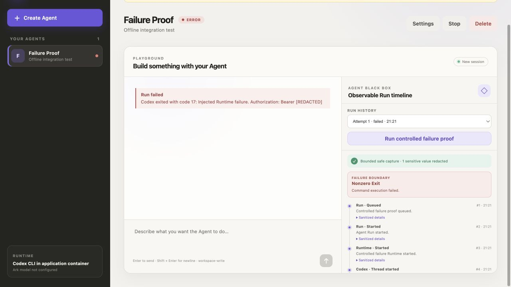
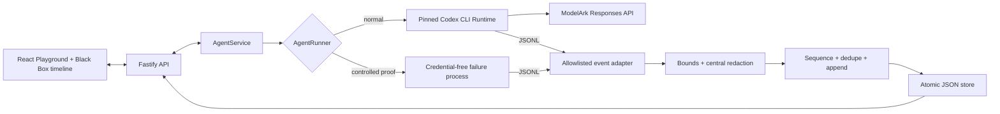

# Agent Black Box

**Every Agent Run tells the truth.** Agent Black Box is lightweight middleware
that turns the observable path of a Run into a correlated, redacted timeline.
Operators can see control-plane lifecycle, Runtime boundaries, command and file
evidence, model usage, and the most specific failure boundary the platform can
honestly support.

The project extends the TikTok TechJam 2026 Track 1 starter without replacing
its Agent CRUD, Playground, persistent workspaces, resumable sessions, JSON
store, disposable Runtime containers, or ModelArk integration.

> [!WARNING]
> This remains a single-user hackathon proof of concept. Trace capture is
> intentionally allowlisted and incomplete, and ordinary containers are not a
> hardened multi-tenant boundary. Use only scoped demo credentials and data.

## What the middleware proves

- A real frontend-to-control-plane-to-Runtime path produces ordered evidence.
- JSONL events are mapped using the pinned Runtime protocol rather than inferred.
- Reasoning and raw command output are never added to the trace store.
- Trace strings and failure messages are bounded and centrally redacted.
- A controlled process/container failure traverses the same Runner, parser,
  persistence, API, and UI path as normal execution.
- Restart-interrupted Runs remain `cancelled` and gain truthful
  `server_restart` evidence.

## Screenshots

### Agent Black Box timeline



### Create an Agent


## Features

- React and TypeScript Web UI
- Agent create, edit, start, stop, delete, and multi-turn chat
- Fastify control plane with asynchronous Run state
- Correlated per-Run timeline with deterministic sequence numbers
- Command, file-change, duration, usage, and terminal evidence
- Central trace redaction, typed metadata, deduplication, and bounded storage
- Run history with failure-boundary highlighting
- Reproducible controlled Runtime failure proof
- Persistent Agent workspaces and Codex sessions
- Disposable Docker, Colima, or Podman container for each local turn
- Docker and Terraform deployment paths for Volcengine ECS

## Requirements

- Node.js 22+
- npm 10+
- Docker, Colima, or Podman
- A Volcengine Ark API key and endpoint that supports the Responses API

Codex CLI is included in the Runtime image and is not required on the host.

## Local browser SOP

### 1. Check the local tools

Install Node.js 22+ and one supported container engine, then verify them:

```bash
node --version
npm --version
docker --version        # Docker Desktop, Docker Engine, or Colima
podman --version        # Use this instead when running Podman
```

Only one container engine is required. Codex CLI is already included in the
Runtime image.

### 2. Clone the repository

```bash
git clone <repository-url> volc-agent-launchpad
cd volc-agent-launchpad
```

Skip this step when already working from the repository root.

### 3. Start the POC

```bash
ARK_API_KEY=your-ark-api-key \
ARK_MODEL=ep-your-endpoint-id \
npm run poc
```

The first run installs Node.js dependencies and builds the Runtime image. The
script automatically selects Docker, Colima, or Podman.

### 4. Open the browser

Visit <http://localhost:3000>, or open it from the terminal:

```bash
open http://localhost:3000       # macOS
xdg-open http://localhost:3000   # Linux desktop
```

In the Web UI:

1. Select **Create Agent**.
2. Enter a name, description, and workspace instructions.
3. Select **Create Agent** again.
4. Enter a task in the Playground, for example:

   ```text
   Create a TypeScript hello-world CLI, add a test, and run it.
   ```

The Agent can write files, run commands, and continue the same Codex session in
later messages. The **Agent Black Box** panel updates while the Run is active
and keeps previous Runs inspectable.

### Run the controlled failure proof

1. Create or select an Agent.
2. Select **Run controlled failure proof** in the Black Box panel.
3. Inspect the ten-event failure chain from queueing through the terminal Run.
4. Confirm the explicit canary is displayed only as `[REDACTED]`.

The fixture is labelled as injected evidence. It emits the pinned JSONL shape
from a real child process or disposable Runtime container and exits with code
17. It does not call ModelArk, execute an external write, or receive the Ark
credential.

### 5. Stop and resume

Press `Ctrl+C` in the startup terminal. The script removes temporary Runtime
containers but keeps Agent workspaces and conversations.

- macOS state: `~/.volc-agent-launchpad/`
- Linux state: `.local/`
- Custom location: set `LOCAL_POC_DATA_ROOT`

Run the same `npm run poc` command to continue later.

### Select a specific container engine

Force Podman when multiple engines are installed:

```bash
CONTAINER_ENGINE=podman \
ARK_API_KEY=your-ark-api-key \
ARK_MODEL=ep-your-endpoint-id \
npm run poc
```

Colima uses `CONTAINER_ENGINE=docker` because it exposes the Docker CLI.

For a clean Linux host, follow the
[rootless Podman setup](docs/LOCAL_POC.md#rootless-podman-on-linux).

## Docker Compose

Create and edit the configuration:

```bash
./scripts/bootstrap-local.sh
```

Required values in `.env`:

```dotenv
ARK_API_KEY=your-ark-api-key
ARK_MODEL=ep-your-endpoint-id
APP_AUTH_TOKEN=replace-with-at-least-24-random-characters
```

Start the application:

```bash
docker compose up --build
```

Open <http://localhost:3000>. Stop it without deleting Agent data:

```bash
docker compose down
```

## Development

```bash
npm install
cp .env.example .env
npm install --global @openai/codex@0.111.0
npm run dev
```

- Web UI: <http://localhost:5173>
- API: <http://localhost:3000>

Use local paths in `.env` when running outside Docker:

```dotenv
APP_DATA_DIR=.data
AGENT_WORKSPACE_ROOT=workspaces
CODEX_HOME=codex-home
```

## Deployment

- [Existing Linux ECS with Docker](docs/DEPLOYMENT.md#existing-linux-ecs)
- [Complete Volcengine environment with Terraform](docs/DEPLOYMENT.md#terraform-deployment)
- [Local Docker, Colima, and Podman details](docs/LOCAL_POC.md)

The existing-ECS script deploys from the current source tree:

```bash
cp .env.example .env.production
./scripts/deploy-existing-ecs.sh .env.production
```

The Terraform path provisions VPC, subnet, security group, ECS, and EIP:

```bash
cp deploy/volcengine/terraform.tfvars.example \
  deploy/volcengine/terraform.tfvars
./scripts/deploy-volcengine.sh
```

## Configuration

| Variable | Default | Purpose |
| --- | --- | --- |
| `ARK_API_KEY` | Required | Ark model API key. |
| `ARK_MODEL` | Required | Responses-capable endpoint or model ID. |
| `ARK_BASE_URL` | Beijing v3 endpoint | Ark OpenAI-compatible API URL. |
| `APP_AUTH_TOKEN` | Empty on loopback | Shared demo token; use 24+ random characters remotely. |
| `RUNTIME_PROVIDER` | `local-process` | `container` for disposable local Runtime containers. |
| `CODEX_SANDBOX_MODE` | `workspace-write` | Codex inner sandbox mode. |
| `CODEX_TIMEOUT_MS` | `600000` | Maximum duration of one turn. |
| `LOCAL_POC_DATA_ROOT` | Platform-specific | Local metadata, workspace, and session directory. |

See [.env.example](.env.example) for all Runtime and resource-limit options.

## How it works



The first turn uses `codex exec`; later turns resume the stored thread. Trace
events use the Run ID as the trace ID. The adapter records observable events,
not hidden reasoning. Deleting an Agent archives its workspace and removes its
Run metadata and traces.

See [Agent Black Box architecture and contracts](docs/AGENT_BLACK_BOX.md) for
the trust boundary, event contract, redaction scope, and failure model.

## Trace API

```text
GET  /api/runs/:id/trace
POST /api/agents/:id/demo-runs  { "fixture": "runtime_nonzero" }
```

Trace responses contain typed, sanitized events only. There is no raw JSONL,
prompt, final model response, stderr, environment object, or request header in
the trace payload.

## Evaluation evidence

| Track 1 category | Evidence |
| --- | --- |
| End-to-end behaviour (40%) | Live Playground Run plus controlled failure through the real backend/Runtime path and timeline UI. |
| Design and integration (25%) | Shared Runner adapter, server-owned recorder/redactor, additive version-1 storage compatibility, no replacement platform. |
| Verification and robustness (20%) | Parser, redaction, sequence, cap, historical data, restart, API, concurrency, and fixture tests. |
| Demo and reproducibility (15%) | One-command local POC, fixed failure proof, Run history, architecture diagram, and documented three-minute path. |

## Three-minute walkthrough

1. **0:00-0:15** - Explain why a terminal `failed` status is insufficient.
2. **0:15-0:30** - Show the architecture and truthful evidence boundary.
3. **0:30-1:15** - Run a real task and show commands, file changes, duration,
   usage, and completion.
4. **1:15-2:05** - Trigger the controlled failure and show the causal chain,
   exit code, failure boundary, and redacted canary.
5. **2:05-2:40** - Switch between Run histories and inspect sanitized details.
6. **2:40-3:00** - Show the green validation gate and known limitations.

## Known limitations

- Single-user, single-process JSON-store architecture.
- Trace capture is allowlisted rather than complete by design.
- Existing Playground prompts and final messages are outside the new
  trace-redaction guarantee.
- Command output is deliberately omitted, so some failures resolve only to the
  command or Runtime boundary.
- Ordinary containers are not hardened tenant isolation.
- Local disposable containers are the supported judging path; ECS is optional.
- A controlled failure proves middleware behaviour but is not represented as a
  real provider outage.

## Team contribution

This is a solo submission. Design, implementation, testing, documentation, and
the demonstration are owned by the submitting participant.

See [docs/ARCHITECTURE.md](docs/ARCHITECTURE.md) for component and extension
boundaries.

## Validation

```bash
npm run check
terraform fmt -check -recursive deploy/volcengine
LAUNCHPAD_ENV_FILE=.env.example docker compose --env-file .env.example config
npm audit --omit=dev
```

## Documentation

- [Architecture](docs/ARCHITECTURE.md)
- [Agent Black Box design](docs/AGENT_BLACK_BOX.md)
- [Local POC](docs/LOCAL_POC.md)
- [Deployment](docs/DEPLOYMENT.md)
- [Hackathon extension guide](docs/HACKATHON_EXTENSION_GUIDE.md)
- [Security policy](SECURITY.md)
- [Contributing](CONTRIBUTING.md)

## License

[MIT](LICENSE)
