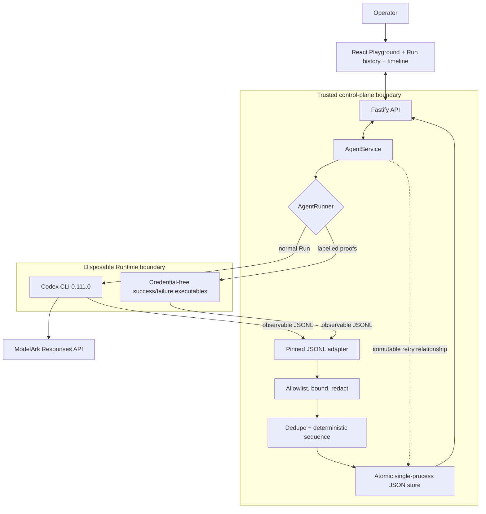

# Agent Black Box architecture and contracts

## Product boundary

Agent Black Box records what the platform can observe. It does not expose or
infer hidden reasoning, claim exact process checkpoint recovery, or present a
controlled failure as a provider incident.

## Persisted event contract

Each event contains a schema version, Run/Agent/trace identifiers, a per-Run
sequence number, a stable deduplication key, source, type, status, timestamp,
safe summary, optional duration, and typed allowlisted metadata.

- Maximum 256 events per Run.
- Normal events stop at 248 and produce one `trace.truncated` marker.
- Terminal Runtime and Run evidence retains reserved capacity.
- Summary limit: 512 characters.
- Command preview limit: 256 characters.
- Metadata limit: 4 KiB; file-change lists stop at 32 entries.
- Absolute or traversal paths become `[OUTSIDE_WORKSPACE]`.

The database remains version 1. Historical stores without `traceEvents` or
newer Run fields normalize to safe defaults when loaded.

## Evidence mapping

The pinned JSONL adapter recognizes thread and turn lifecycle, command
execution, file changes, usage, explicit errors, and final messages. Final
messages continue to support the existing Playground but are not copied into
trace metadata. Reasoning items, raw command output, arbitrary MCP payloads,
and unknown event objects are not persisted.

## Redaction scope

Redaction applies before new diagnostic data reaches trace persistence, trace
APIs, the trace UI, or stored Runtime failure messages. It covers authorization
headers, Bearer values, common key/token/password assignments, URL credentials,
and sensitive query parameters. Input is bounded before pattern matching, and
the replacement is deterministic and idempotent.

The guarantee intentionally does not cover existing Playground prompt and
assistant-message storage. Users must not place real secrets in prompts.

## Failure model

Stable failure codes identify the closest proven boundary: Runtime
availability/start, non-zero exit, timeout, cancellation, output limit,
explicit Codex error, missing final message, restart interruption, trace
persistence, or unknown Runtime failure.

Restart-interrupted active Runs remain `cancelled` and receive
`server_restart` plus `run.interrupted`. Error text is bounded and redacted
before it reaches the Run, Agent, trace, or API response.

## Controlled failure proof

The fixed failure executable emits valid pinned JSONL, reports a fake canary in
an error, and exits with code 17. Both Runner providers select it explicitly;
the container path does not forward `ARK_API_KEY`. The resulting evidence uses
the same parser, recorder, JSON store, API, polling, and timeline as a normal
Run. This makes the negative case deterministic without fabricating a success
or relying on a transient external outage.

## Credential-free Playground task and linked recovery

When ModelArk is unavailable, the success fixture performs a real write and
read-back verification of `recovery-proof.txt` inside the selected Agent
workspace. It emits command, file-change, usage, and terminal JSONL evidence
with zero model tokens. A user selects its fixed, visible task in the existing
Playground and presses Send, so the normal user-message, Run, Runtime, trace,
and assistant-message lifecycle remains observable. The backend accepts only
that exact task for this proof mode. The UI and documentation identify it as a
Runtime proof, not model inference.

A retry is a new immutable Run. The server validates the unsuccessful source,
Agent availability, and one direct child per source inside a serialized store
mutation. The caller supplies a UUID idempotency key: repeating the same key
returns the existing attempt, while a different key conflicts. Controlled
failure retries select the credential-free success Runtime; real model retries
reuse a thread only when it existed before the failed attempt. Every retry
reuses the persisted workspace and exposes its actual recovery mode.

## Security and operational limitations

- The store serializes writes and supports one process.
- Trace events are logically append-only, but the backing JSON file is replaced
  atomically on each mutation.
- Ordinary Docker/Podman containers are not hardened multi-tenant isolation.
- Broad network access and prompt-triggered command execution remain starter
  limitations.
- The controlled fixture is safe demonstration evidence, not a production
  incident simulator.
- Retrying arbitrary external side effects is not production-safe; the included
  proof uses an idempotent local file target.
